layout: true

```{r setup, include=FALSE}
options(htmltools.dir.version = FALSE)
knitr::opts_chunk$set(
  eval = TRUE,
  message = FALSE,
  echo = TRUE,
  warnings = FALSE,
  fig.align = "center"
)
```

---

# An introduction round

--

Say a few words about you and why you are here!

What do you expect to learn today - and tomorrow?

---

# Goals

- understand what single-cell RNA-sequencing is and "can do for you"
- get to know the data and the data analysis steps
- learn how it is possible to explore these datasets in an interactive and reproducible way

--

Understand general concepts behind their analysis > knowing which tool you should use right now, the field is (still) evolving very fast - but some common guidelines seem to have emerged

"Orchestrating Single-Cell Analysis with Bioconductor" is an excellent starting point for many to read about the state of the art in R/Bioconductor + the companion book online (https://osca.bioconductor.org/)

--

### Requirements:

Some familiarity with R (and RNA-sequencing) - see the OSCA book for a primer for that as well

<!-- The goal of this book is to provide a solid foundation in the usage of Bioconductor tools for single-cell RNA-seq analysis by walking through various steps of typical workflows using example datasets. We strive to tackle key concepts covered in the manuscript, “Orchestrating Single-Cell Analysis with Bioconductor”, with each workflow covering these in varying detail, as well as essential preliminaries that are important for following along with the workflows on your own. -->


---

# Why single-cell?

--

Think of a _smoothie_ vs _the berries_ - what are you interested into?

--

<blockquote class="twitter-tweet"><p lang="en" dir="ltr">Here is the transcriptomics insight: the bulk RNA-seq (Fig 1), single-cell RNA-seq (Fig. 2), spatial transcriptomics (Fig. 3), and the original organ (Fig. 4). <br><br>(Feel free to cite with image credit to Bo Xia) <a href="https://t.co/wQLx8PDVFm">pic.twitter.com/wQLx8PDVFm</a></p>&mdash; Bo Xia (@BoXia7) <a href="https://twitter.com/BoXia7/status/1261464021322137600?ref_src=twsrc%5Etfw">May 16, 2020</a></blockquote> <script async src="https://platform.twitter.com/widgets.js" charset="utf-8"></script> 

---

# Why single-cell?

In single-cell RNA-sequencing (scRNA-seq), the RNA of a single cell is sequenced

--

scRNA-seq allows disentanglement of complex biological systems


--

Gene expression data on a single-cell level allows us to answer hypotheses of interest that were previously unavailable with bulk RNA-seq - Got an example for this?

--

- Heterogeneity of gene expression between single cells
- Identification of novel and rare cell types
- Reconstructing single-cell developmental/activational trajectories (e.g. development of stem cell to a mature cell type, activation of cells following treatment)
- Studying sparsely occurring cell populations (e.g. stem cell niches)

---

# Protocols

scRNA-seq remains a fast-paced field with continuous active developments

--

<p align="center">
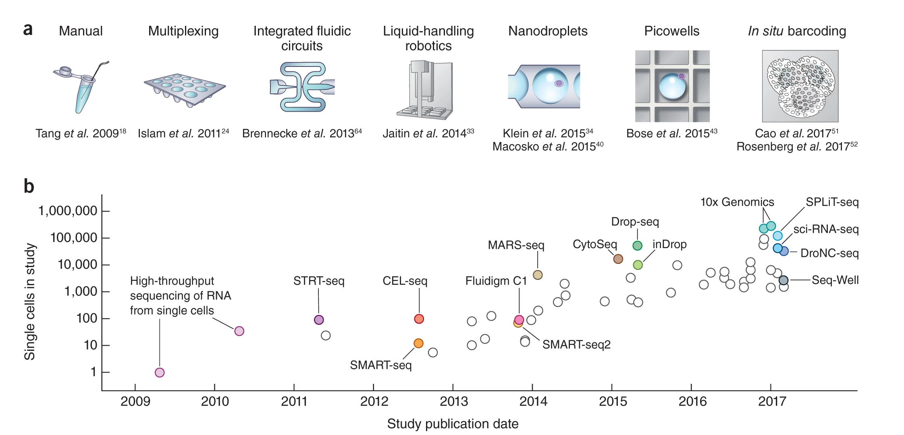
</p>

Svensson, 2018 (Nat Protocols)

---

# Protocols

scRNA-seq remains a fast-paced field with continuous active developments

<p align="center">
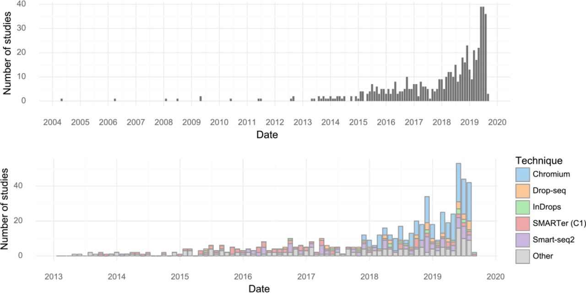
</p>

Svensson, 2019 (bioRxiv)

---

# There's not just one single cell method

"I'm planning my next experiment" - Which one to choose?

<p align="center">
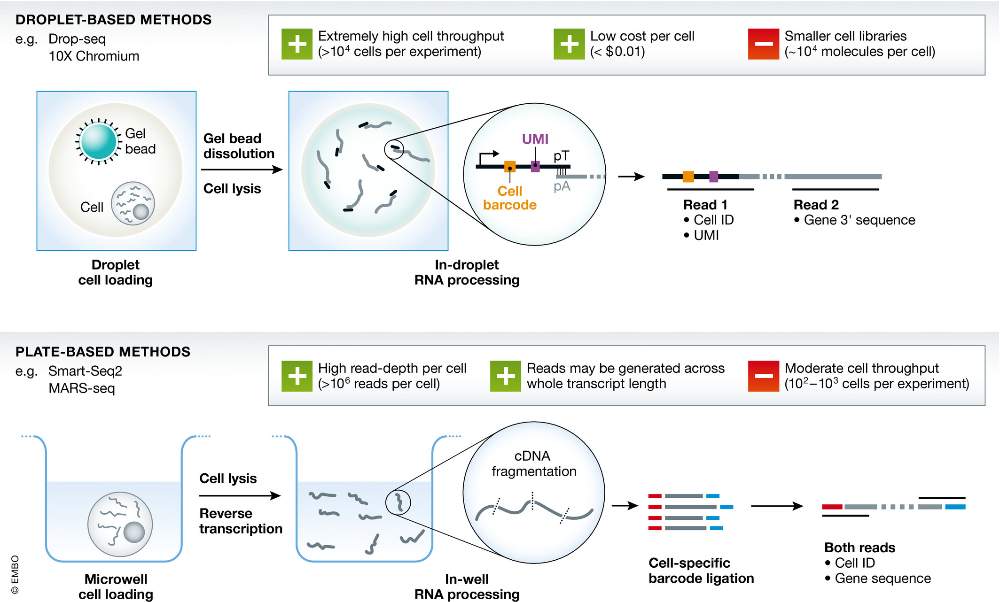
</p>

---

# There's not just one single cell method

"I'm planning my next experiment" - Which one to choose?


Droplet-based protocols are more suited for 
- Examining the composition of a tissue
- Identifying novel / rare cell types

--

Plate-based protocols are more suited for
- Studying a rare cell population with known surface markers (through FACS sorting)
- Isoform-level analysis (full-length transcript information)
- Marker gene discovery?

--

Droplet-based protocols allow for a higher throughput, plate-based protocols seem to have a higher signal-to-noise ratio per cell

--

*Think of the one most suitable/tailored to your research question!*

--

*Think of a research question!*

---

# There's not just one single cell method

Quantification differs!

- Plate-based protocols adopt read counting (like in bulk RNA-seq)
- Droplet-based protocols typically adopt unique molecular identifiers (UMIs) to quantify gene expression

<p align="center">
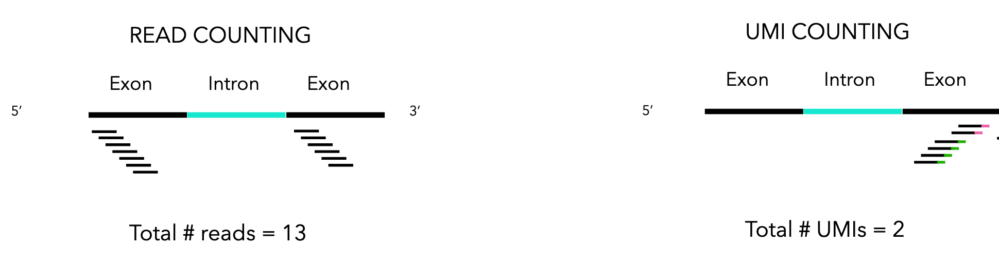
</p>

--

- Read counts are affected by e.g. gene length, sequencing depth and PCR amplification bias
- UMIs were introduced to avoid this, however this is only true if every cell is sequenced to saturation
- Between-cell normalization is still crucial!
- Due to the counting strategy, UMI counts can be interpreted as a proxy for the number of transcripts originally present in the cell


---

# General features of sc data

- Count matrices are _also_ very different between protocols
- (Very) sparse matrices!
- (Much) more variable than bulk RNA-seq

<p align="center">
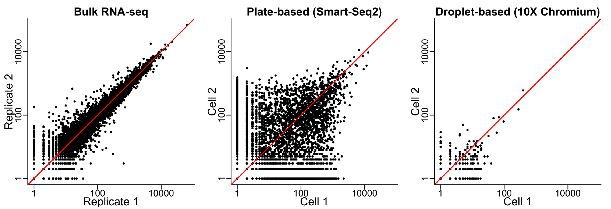
</p>

--

*Can you think of some consequences for this?*

---

background-image: url("images/workflow_singlecell.jpg")
background-size: contain
background-position: 50% 50%
class: bottom, center

# An overview of the workflow(s)

---

# An overview of the workflow(s)

As of 2024, there are some "overarching" analytic frameworks

* Seurat
* Scanpy
* Bioconductor

--

Which one to choose?  
Possibility to interconvert among formats make the choice less painful

--

<p align="center">
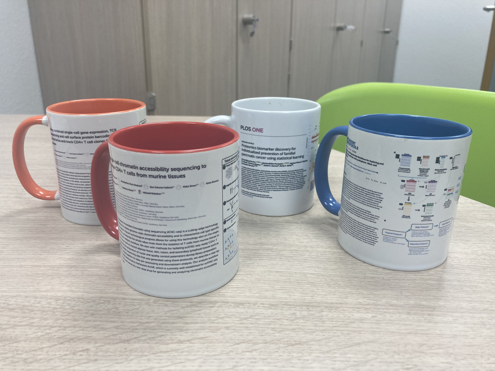
</p>

---

background-image: url("images/Bioconductor-serial.gif")
background-position: 50% 10%
class: bottom, center

# Orchestrating Single-Cell Analysis with Bioconductor

---

# Quality Control: never enough

We'll need to identify (and mark/remove)

- low-quality (e.g. dead/damaged) cells
- doublets (droplets/wells containing 2+ cells)
- empty droplets (droplets/wells without any cells)

Typically in data-driven way, with adaptive thresholds (DoubletFinder, EmptyDrops)

A very good friend of yours: the `scater` package!

---

# "Same" data, different workflow

How does the data look like?

--

- Bulk RNA-seq: we typically know which groups we want to compare (e.g., treatment vs. control)

--

- In single-cell RNA-seq, we are often interested in comparing gene expression between different cell types

Highly recommended: use the `SingleCellExperiment` class as a container for your data!

--

Still: we first must identify the cell types in order to be able to compare them 

- The differential expression analysis is usually preceded by identification of cell identity, typically through clustering in reduced dimensionality

--

What's a cell identity anyway? This can be vague, and may include both cell type (e.g., leukocyte vs. erythrocyte) and cell state (e.g., cell cycle phase)

---

# Normalization

--

Systematic differences in sequencing coverage between libraries are often observed in single-cell RNA sequencing data

--

Normalization aims to remove these differences such that they do not interfere with comparisons of the expression profiles between cells

-> Any observed heterogeneity or differential expression within the cell population are driven by biology and not technical biases

--

Normalization by deconvolution works very nicely (pooling counts to better estimate size factors) - `scran` and `calculateSumFactors()`

--

`logNormCounts` does... compute log-transformed normalized expression values (useful e.g. for visualization)

--

This is different from batch correction (relevant when integrating different samples)!

---

# Feature selection

--

Next tasks: clustering and dimensionality reduction, comparing cells based on their gene expression profiles

Required: aggregating per-gene differences into a single (dis)similarity metric between a pair of cells

--

- The choice of genes to use in this calculation has a major impact 
- We want to select genes that contain useful information about the biology of the system 
- ...while removing genes that contain random noise. 

--

Preserve interesting biological structure + reduce the size of the data to improve computational efficiency of later steps

--

`modelGeneVar()` + `getTopHVGs()` 

---

# Dimensionality reduction

--

- Comparing 1 gene vs 1 gene: easy-peasy

- When dealing with the distance between many genes vs many: it can even become untractable!

--

Goal of dimensionality reduction: reduce our G x C matrix to a Q x C matrix, where Q << G, while retaining as much signal in the data as possible

Purposes:
- Visualization
- Identification of batch effects
- Clustering in reduced dimensionality

--

Traditional DR methods are insufficient, e.g. PCA alone is inappropriate for count data (Townes et al. 2019)

Many dimensionality reduction methods are being used in scRNA-seq - Most popular ones are non-linear DR methods, e.g. t-SNE and UMAP (not restricted to linear transformations, nor obliged to accurately represent distances between distant populations)

--

Run PCA + Cluster on the first 10-50 PCs + Visualize the cluster identities on the t-SNE plot (i.e. avoid using t-SNE coordinates directly for clustering)

---

# Clustering

--

Different cell identity -> reflected by a different gene expression profile? We can cluster cells to identify cell types

- Goal: group cells together that have similar expression profiles 
- Typically occurs in reduced dimension or based on a subset of interesting genes

- Next step: after annotation based on marker genes, the clusters can be treated as proxies for more abstract biological concepts such as cell types or states. Critical step for extracting biological insights!

--

Methods more refined than classical k-means are available: 

- Graph-based methods: cluster cells that are connected together (e.g., using nearest neighbours), e.g. `buildSNNGraph()` or Seurat (uses Louvain's algorithm behind the scenes)
- Consensus clustering: cluster cells that are often clustered together over several clustering algorithms (some cells will be unclustered), e.g. RSEC (Risso et al. (2018)) 

--

**Think!**
What does a clustering algorithm do? What is the truth (e.g. true number of clusters)? Iterative approaches are entirely permissible for data exploration, which constitutes the majority of all scRNA-seq data analyses!

---

# Marker gene detection

Goal: identify the genes that drive separation between clusters, to interpret our clustering results...

--

... so that we can assign biological meaning to each cluster based on their functional annotation

This step is usually based around the retrospective detection of differential expression between clusters

Option: focus on up-regulated markers (easier to interpret to assign putative identity)

--

`findMarkers` in `scran`

--

*Just a provocation? Do we all agree on what a marker gene is?*

---

# Cell type annotation

--

Obtaining clusters of cells: straightforward - determine what biological state is represented by each of those clusters: much more difficult

**Aim**: bridge the gap between the current dataset and prior biological knowledge

--

"I’ll know it when I see it"-intuition, not so amenable for large scale computational analyses -> interpretation of scRNA-seq data is often manual and a common bottleneck in the analysis workflow.

Still: we can use various computational approaches that exploit prior information to assign meaning (labels) to an uncharacterized scRNA-seq dataset (yours) 

--

`SingleR` can have lots of goodies for you, provided a suitable reference exists - It assigns labels to cells based on the reference samples with the highest Spearman rank correlations (kind of a rank-based variant of k-nearest-neighbor classification)

--

Other options: Seurat's reference mapping, label transfer, multi-modal data becomes available

--

**Think!**  
What can be the key issues here?

<!-- missing cell types, unmatched references, novel cell types, ... -->

---

# Integrating datasets

--

Batch effects: systematic technical variation in the dataset that are not of interest

Large scale experiments usually need to generate data across multiple batches due to logistical constraints -> Can represent known sources of variation, e.g. plate effects, different sequencing runs

--

Computational correction of these effects is critical for eliminating batch-to-batch variation, aids identification of biological cell types

--

Care must be taken to avoid confounding, e.g. do not separate control and treatment cells on two different plates for plate-based scRNA-seq

--

MNN correction (Haghverdi 2018) and Seurat's `FindIntegrationAnchors` + `IntegrateData` work reasonably well in many cases.  
If using (extremely) large datasets, Harmony can also be a very valid option.

--

**Think!**  
How do you know whether the integration was helpful (or deleterious)?

---

# Comparisons

--

**Aim**: discover marker genes that differentiate cell types or biological groups

The statistical models used in scRNA-seq typically build on the GLM framework

--

Differential analyses of multi-condition scRNA-seq experiments, split into two categories 

- Differential Expression (DE) - tests for changes in expression between conditions for cells of the same type that are present in both conditions
- Differential Abundance (DA) - tests for changes in the composition of cell types (or states, etc.) between conditions

--

DA and DE analyses are simply two different perspectives on the same phenomena - For any comprehensive characterization of differences between populations, consider both analyses!

--

So-called pseudobulk methods + count-based bulk RNA-seq DE methods (e.g., edgeR, DESeq2) can be directly leveraged!

See the `muscat` package for an excellent implementation

---

# Dynamic systems

--

Many biological processes manifest as a dynamical continuum of changes in the cellular state.

This continuity is represented with a trajectory

--

A trajectory here is a path through the high-dimensional expression space, traversing the various cellular states associated with a continuous process (e.g. differentiation)

--

- Based on the trajectory, one can estimate _pseudotime_ for each cell
- Pseudotime corresponds to the length of the trajectory, and can be considered as a proxy for true developmental time

--

`slingshot` + graph-based minimum spanning trees + PAGA

---

# New technology

Novel technologies are allowing for spatial scRNA-seq

Development of many single-cell multi-omics protocols:

- REAP-seq, CITE-seq: RNA and protein abundance
- sci-CAR: RNA abundance and chromatin conformation (i.e., ATAC-seq)
- G&T-seq: DNA-seq and RNA-seq
- sc-GEM: RNA-seq, with genotype and methylation information 
- scNMT: nucleosome, methylation, transcription

--

Who's up to generate such cool datasets?  

---

# Interactive data exploration

--

Visualization and exploration are fundamental at **any** of these stages.

Left at the end only to bridge over to the next section :)

--

### Meet `iSEE`

<p align="center">

</p>

---


background-image: url("images/console_logcounts_sparse.png")
background-size: contain
background-position: 50% 50%
class: middle, center

# (Interactive) Exploration and visualization: why?

Effective and efficient methods are key to deliver...

--

`r icons::fontawesome('check')` better **quality assessment**

--

`r icons::fontawesome('check')` better **generation of research hypotheses**

--

`r icons::fontawesome('check')` better **representation of the results**

--

`r icons::fontawesome('check')` better **communication** of findings

---

# <i class="fas fa-users"></i> The iSEE team

<table>
<tr>
<td width="25%"><a href="https://kevinrue.github.io"></a></td>
<td width="25%"><a href="https://csoneson.github.io"></a></td>
<td width="25%"><a href="https://federicomarini.github.io"></a></td>
<td width="25%"><a href="https://orcid.org/0000-0002-3564-4813"></a></td>
</tr>
<tr>
<td align='center' width="25%">Kevin</td>
<td align='center' width="25%">Charlotte</td>
<td align='center' width="25%">Federico</td>
<td align='center' width="25%">Aaron</td>
</tr>
</table>

<p align="center">
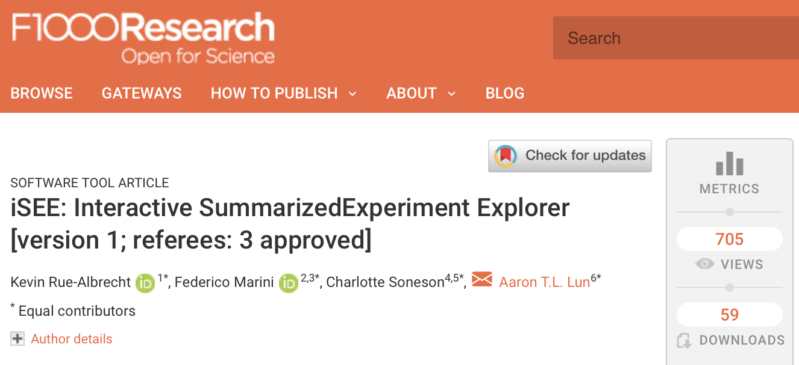
</p>

[`https://f1000research.com/articles/7-741/v1`](https://f1000research.com/articles/7-741/v1)
<br>**[`https://bioconductor.org/packages/iSEE/`](https://bioconductor.org/packages/iSEE/)**

---

# <i class="fas fa-pencil-ruler"></i> <i class="far fa-lightbulb"></i> Designed in & for Bioconductor

```{r, fig.align='center', out.width='75%', eval=TRUE, echo=FALSE}
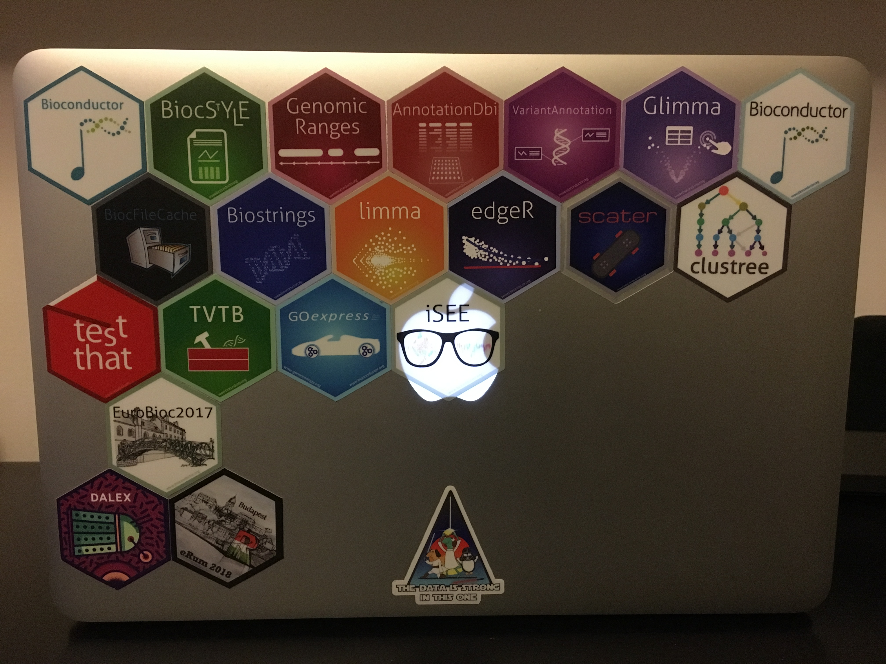
```


[`https://bioconductor.org`](https://bioconductor.org)

???

iSEE tightly integrates with other packages of the Bioconductor project.

---

# SingleCellExperiment

<p align="center">

</p>

.footnote[

[`https://osca.bioconductor.org`](https://osca.bioconductor.org)

]

???

iSEE focuses on the SingleCellExperiment class.
This class stores all the data and metadata associated with assays, cells, and features.

---

# SingleCellExperiment usage in a workflow

.pull-left[
- Data import (`DropletUtils`, `tximeta`)

- Quality control (`scater`)

- Normalization, feature selection (`scran`, `zinbwave`)

- Dimensionality reduction (`BiocSingular`, `scater`, `zinbwave`)

- Clustering (`SC3`, `clustree`)

- Marker gene detection (`scran`, `scDD`)

- Trajectory inference (`slingshot`)

- Visualization (`iSEE`) and much more...
]

.pull-right[
```{r, fig.align='center', echo=FALSE}
knitr::include_graphics("images/bioc-figures_v2-03.png")
```
]

???

The SingleCellExperiment class is designed to accommodate all the information produced along a typical single-cell analysis workflow.

Those data include raw data:

- raw assay data
- experimental metadata
Processed data:
- quality control metrics
- normalized data
- dimensionality reduction results
Downstream analyses:
- cluster labels
- differential expression results
- downstream cell and feature annotations

---

# `iSEE` `r emo::ji("heart")` SingleCellExperiment

<p align="center">
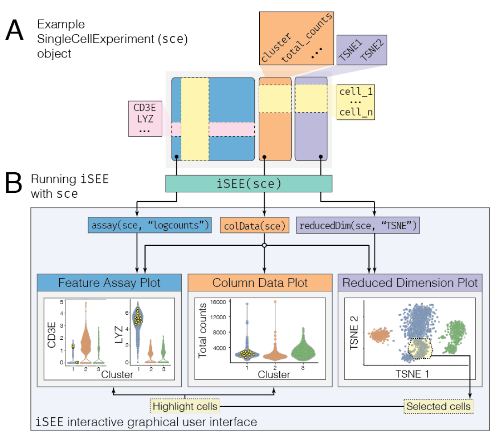
</p>

???

Here we demonstrate how iSEE dissects SCE objects to produce figures.

---

# The `iSEE` interface

<p align="center">
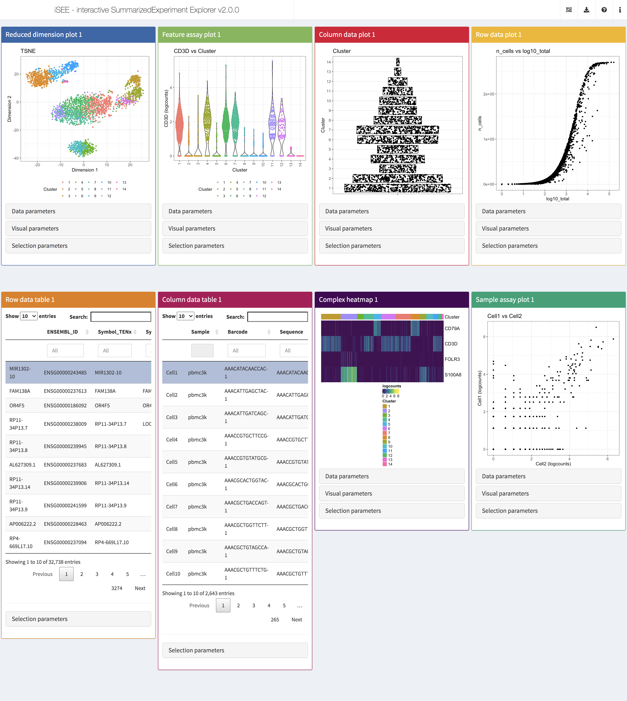
</p>

???

iSEE provides a powerful yet flexible user interface that includes 8 predefined panel types.
That said, it also gives the freedom to define any number custom panel types, both plots and tables.

---

# <i class="fas fa-exclamation-triangle"></i> Reinventing the wheel?

<i class="fab fa-github"></i> [`https://github.com/federicomarini/awesome-expression-browser`](https://github.com/federicomarini/awesome-expression-browser)

<!-- approximately >100 entries! and counting-->

--

<p align="center">

</p>

--

<i class="fas fa-medal"></i> [`https://blog.rstudio.com/2019/04/05/first-shiny-contest-winners/`](https://blog.rstudio.com/2019/04/05/first-shiny-contest-winners/)

???

Don't try this at home.

The wealth of information produced by single-cell analysis workflows has motivated the development of many interactive applications to help researchers explore their data sets.
Each of those applications has its own strengths and limitations.
It is very tempting to develop new applications to with their own strengths and limitations.
Before you decide to do so, we encourage you to test iSEE.
You may find that it already does everything you would like!

iSEE won the RStudio Shiny Contest in April 2019 with mention for "Most technically impressive".

In particular:

- There were 136 submissions from 122 unique app developers!

---

# <i class="fas fa-globe-americas"></i> The `iSEE`-verse

* [`https://bioconductor.org/packages/iSEE/`](https://bioconductor.org/packages/iSEE/)

* [`https://bioconductor.org/packages/iSEEu/`](https://bioconductor.org/packages/iSEEu/)

---

# <i class="fas fa-globe-americas"></i> The `iSEE`-verse

* [`https://bioconductor.org/packages/iSEE/`](https://bioconductor.org/packages/iSEE/)

* [`https://bioconductor.org/packages/iSEEu/`](https://bioconductor.org/packages/iSEEu/)

* <i class="fab fa-github"></i> [`iSEE`](https://github.com/iSEE) organization
  + <i class="fab fa-github"></i> [`iSEE/iSEE`](https://github.com/iSEE/iSEE) source code
  + <i class="fab fa-github"></i> [`iSEE/iSEE2018`](https://github.com/iSEE/iSEE2018) manuscript
  + <i class="fab fa-github"></i> [`iSEE/iSEE-book`](https://github.com/iSEE/iSEE-book) repository for the book about extending `iSEE`
  + <i class="fab fa-github"></i> [`iSEE/iSEEu`](https://github.com/iSEE/iSEEu) source code for `iSEEu`, containing additional panels and modes for `iSEE`
  + <i class="fab fa-github"></i> [`iSEE/iSEE_custom`](https://github.com/iSEE/iSEE_custom) example of custom panels
  + <i class="fab fa-github"></i> [`iSEE/iSEE_instances`](https://github.com/iSEE/iSEE_instances) gallery of complete analyses on public data


???

The growing functionality of the iSEE package is demonstrated in various places:

- The Bioconductor website is the primary source of information for the latest release and development package versions.
- The package GitHub repository is the place to monitor the latest developments, open issues, and contribute pull requests (consider the Bioconductor support website for general questions)
- kevinrue/iSEE_custom demonstrates the development of custom panels through a gallery of examples
- federicomarini/iSEE_instances demonstrates the integration of iSEE with entire analyses of publicly available datasets through a gallery of examples
- Finally, the iSEE workshop was written for the Bioconductor conference 2019 to showcase the functionality of the iSEE package for both newcomers and experienced R users.

---

## <i class="fas fa-hand-spock"></i> <i class="fas fa-hand-spock"></i> <i class="fas fa-laptop"></i> Hands-on, with iSEE!

.pull-left[
<p align="center">
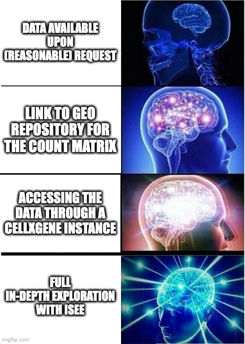
</p>
]

.pull-right[
- [`iSEE/iSEEdemo`](https://github.com/iSEE/iSEEdemo) - a compact summary workshop
- [`iSEE/iSEEWorkshop2020`](https://github.com/iSEE/iSEEWorkshop2020) - a fully fledged workshop, expected to contain all information to reproduce the setup & analysis
- [`iSEE/iSEEWorkshopEuroBioc2020`](https://isee.github.io/iSEEWorkshopEuroBioc2020/) - some focused "recipes"
]

---

# <i class="fas fa-microphone"></i> Voice recognition

.center[`iSEE(sce, voice=TRUE)`]

<div style="position: relative; padding-bottom: 56.25%; height: 0; overflow: hidden;">
  <iframe src="https://www.youtube.com/embed/0crFZLwAJOE?autoplay=0" style="position: absolute; top: 0; left: 0; width: 100%; height: 90%; border:0;" allowfullscreen title="YouTube Video"></iframe>
</div>

???

iSEE can be extended using third-party JavaScript libraries.
Here we demonstrate how speech recognition was integrated to support a number of predefined vocal commands.

---

# <i class="fas fa-bug"></i> Sorry, our software is full of bugs

.center[`iSEE(sce, bugs=TRUE)`]

```{r, fig.align='center', out.width='90%', echo=FALSE}
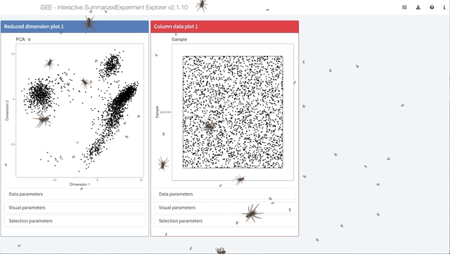
```

???

iSEE can be extended using third-party JavaScript libraries.
Here we demonstrate how speech recognition was integrated to support a number of predefined vocal commands.

---

# Resources

- Orchestrating single-cell analysis with Bioconductor ([`https://www.nature.com/articles/s41592-019-0654-x`](https://www.nature.com/articles/s41592-019-0654-x)) + [`https://osca.bioconductor.org/`](https://osca.bioconductor.org/)

- A step-by-step workflow for low-level analysis of single-cell RNA-seq data with Bioconductor: [`https://f1000research.com/articles/5-2122`](https://f1000research.com/articles/5-2122)

- Current best practices in single-cell RNA-seq analysis: [`https://www.embopress.org/doi/pdf/10.15252/msb.20188746`](https://www.embopress.org/doi/pdf/10.15252/msb.20188746)

- Seurat's website; Scanpy's website


---

class: middle, center

## ... thank you for your attention!
<code>marinif@uni-mainz.de - `r icons::fontawesome('twitter')`</code> [`@FedeBioinfo`](https://twitter.com/FedeBioinfo)


---

<!-- empty slide -->


